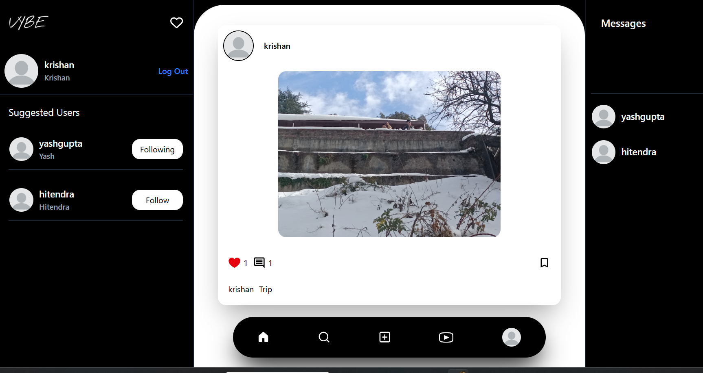
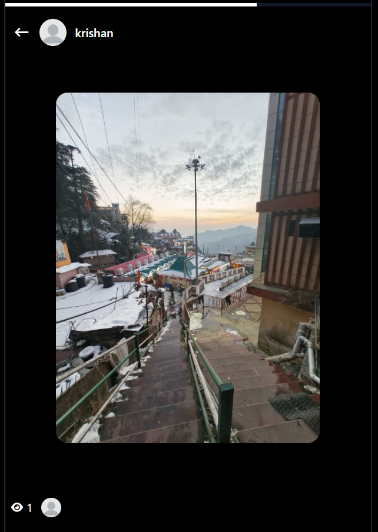
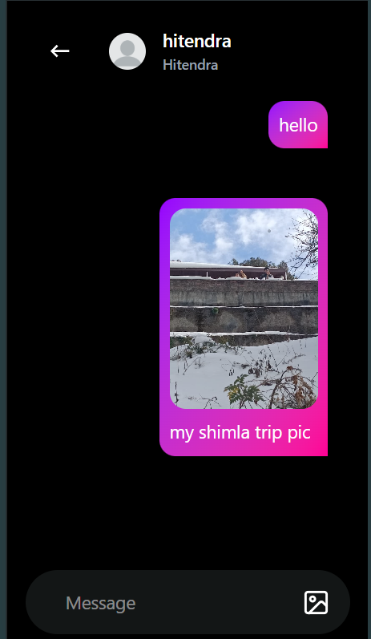

# VIBE - Social Media Platform

A modern, full-stack microservices-based social media application built with React, Node.js, Express, MongoDB, Kafka, Redis, and Socket.io. VIBE enables users to connect, share moments, chat in real-time, and discover exciting content.



## 🌐 Live Demo

**Try VIBE now:** [https://new-vybe.vercel.app/](https://new-vybe.vercel.app/)

---

## 🎯 Overview

VIBE is a feature-rich social platform that combines the best elements of modern social networks. Users can share posts and reels, create stories, message friends in real-time, and engage through likes, comments, and follows. 

The platform is built on a **scalable microservices architecture**, utilizing an API Gateway, event-driven communication via Kafka, and WebSocket technology for instant messaging and online user tracking backed by Redis.

---

## ✨ Key Features

### 👤 Authentication & User Management
- **Sign Up/Sign In** - Secure user registration with bcryptjs password hashing
- **Forgot Password** - OTP-based password reset via email
- **User Profiles** - Customize profiles with picture, bio, profession, and gender
- **Follow/Unfollow system** - Manage followers and following lists
- **Suggested Users** - Discover new users to follow
- **Online Status** - Real-time online/offline indicators via WebSocket

### 📸 Posts
- **Create Posts** - Upload photos/videos with captions via Cloudinary
- **Engage with Posts** - Like, unlike, and comment on posts
- **Save Posts** - Bookmark posts for later
- **Feed** - Chronological feed of posts from followed users



### 🎬 Loops (Short Videos/Reels)
- **Create Loops** - Upload short video clips with captions
- **Infinite Scroll** - Discover endless content
- **Engage** - Like, comment, and share reactions
- **Loop Feed** - Browse through trending short videos

### 📖 Stories
- **Create Stories** - Share photos and videos as stories
- **Auto-Expiry** - Stories automatically expire after 24 hours
- **Viewer Tracking** - See who viewed your stories
- **Story Ring** - Visual indicators for unviewed stories

### 💬 Real-Time Messaging
- **One-on-One Chat** - Private conversations with real-time delivery via Socket.io
- **Message History** - View past conversations saved in MongoDB
- **Media in Messages** - Send images along with messages
- **Cross-Service Scaling** - WebSocket connections scaled using Redis Pub/Sub adapter



### 🔔 Notifications
- **Event-Driven Alerts** - Notifications powered by **Apache Kafka** event streaming
- **Real-Time Delivery** - Instant push notifications via Socket.io
- **Notification Types** - Post/Loop Likes, Comments, and User Follows

### 📱 Responsive Design
- **Mobile Optimized** - Works seamlessly on all devices
- **Tailwind CSS** - Modern, responsive UI framework
- **Dark Theme** - Dark-themed interface for comfortable viewing

---

## 🏗️ Tech Stack & Architecture

### Architecture Overview
The application utilizes a distributed **Microservices Architecture**:
- **API Gateway**: Routes traffic from the frontend to the appropriate microservice.
- **Service Isolation**: 5 distinct backend services (Auth, User, Content, Messaging, Notification).
- **Event-Driven**: Services communicate asynchronously using **Apache Kafka** (e.g., when a user likes a post in the Content Service, an event is sent to the Notification Service).
- **Shared Data Layer**: Uses a shared MongoDB cluster for simplified data consistency across services.

### Backend Infrastructure
- **Node.js & Express** - Microservices framework
- **MongoDB & Mongoose** - Primary database
- **Apache Kafka** - Event streaming platform (Confluent Cloud for production)
- **Redis (Upstash)** - Caching and Socket.io adapter for horizontal scaling
- **Socket.io** - WebSockets for real-time messaging and online status
- **JWT & Bcryptjs** - Authentication and security
- **Cloudinary** - Image and video hosting

### Frontend
- **React 19** - UI library
- **Vite** - Lightning-fast build tool
- **Redux Toolkit** - State management
- **Tailwind CSS** - Styling framework
- **React Router** - Navigation
- **Socket.io Client** - Real-time communication

---

## 📂 Project Structure

```
VIBE/
├── services/                 # Microservices Backend
│   ├── api-gateway/          # Central entry point, handles routing & CORS
│   ├── auth-service/         # Handles signup, signin, OTP, password reset
│   ├── user-service/         # Profile management, follows, user search
│   ├── content-service/      # Posts, Loops, Stories, and Feeds
│   ├── messaging-service/    # Direct messaging and Socket.io (chat)
│   └── notification-service/ # Kafka consumer, Socket.io (alerts)
│
├── frontend/                 # React Application
│   ├── src/
│   │   ├── components/       # Reusable UI components
│   │   ├── pages/            # Page components (Home, Profile, Messages, etc.)
│   │   ├── hooks/            # Custom React hooks
│   │   ├── redux/            # State management slices
│   │   ├── App.jsx
│   │   └── main.jsx
│   └── package.json
│
├── docker-compose.yml        # Local development infrastructure (MongoDB, Redis, Kafka)
├── .env.example              # Environment variables template
└── README.md
```

---

## 🚀 Getting Started (Local Development)

### Prerequisites
- Node.js (v20 or higher)
- Docker Desktop (for running local infrastructure)
- npm or yarn

### 1. Infrastructure Setup (Docker)
The easiest way to run the required databases locally is using Docker Compose.

1. Ensure Docker Desktop is running.
2. From the root of the project, run:
   ```bash
   docker-compose up -d
   ```
   *(This starts local instances of MongoDB, Redis, and Kafka/Zookeeper).*

### 2. Environment Configuration
1. Copy the `.env.example` file in the root directory to `.env` and fill in your Cloudinary and Email credentials.
2. Ensure each microservice inside the `services/` folder has its own `.env` file configured properly (these can point to `localhost` for DBs when running locally).

### 3. Start Backend Services
You must install dependencies and start each microservice individually (or use a terminal multiplexer).

For each service in the `services/` directory (`api-gateway`, `auth-service`, `user-service`, `content-service`, `messaging-service`, `notification-service`):
```bash
cd services/<service-name>
npm install
npm run dev
```

### 4. Start Frontend
1. Open a new terminal and navigate to the frontend directory:
   ```bash
   cd frontend
   ```
2. Install dependencies and start the Vite dev server:
   ```bash
   npm install
   npm run dev
   ```
3. The app will be available at `http://localhost:5173`.

---

## 📄 Deployment

This application is configured for production deployment:
- **Frontend**: Deployed on [Vercel](https://vercel.com/)
- **Backend Services**: 6 separate Web Services deployed on [Render](https://render.com/)
- **Databases/Brokers**: 
  - MongoDB Atlas (Database)
  - Confluent Cloud (Kafka Event Streaming with SASL/SSL)
  - Upstash (Redis Caching)

*(See `docs/deployment-guide.md` in the repository for full deployment instructions).*

---

## 🤝 Contributing
Contributions are welcome! Please feel free to submit pull requests or open issues for bugs and feature requests.

## 📄 License
This project is open source and available under the ISC License.

## 👨‍💻 Developer
Created by Krishan

## 🙏 Acknowledgments
- React and Vite communities
- Socket.io for real-time communication
- Cloudinary for media hosting
- Tailwind CSS for styling
- MongoDB, Kafka, and Redis for infrastructure

---
**Happy Vibing! 🎉**